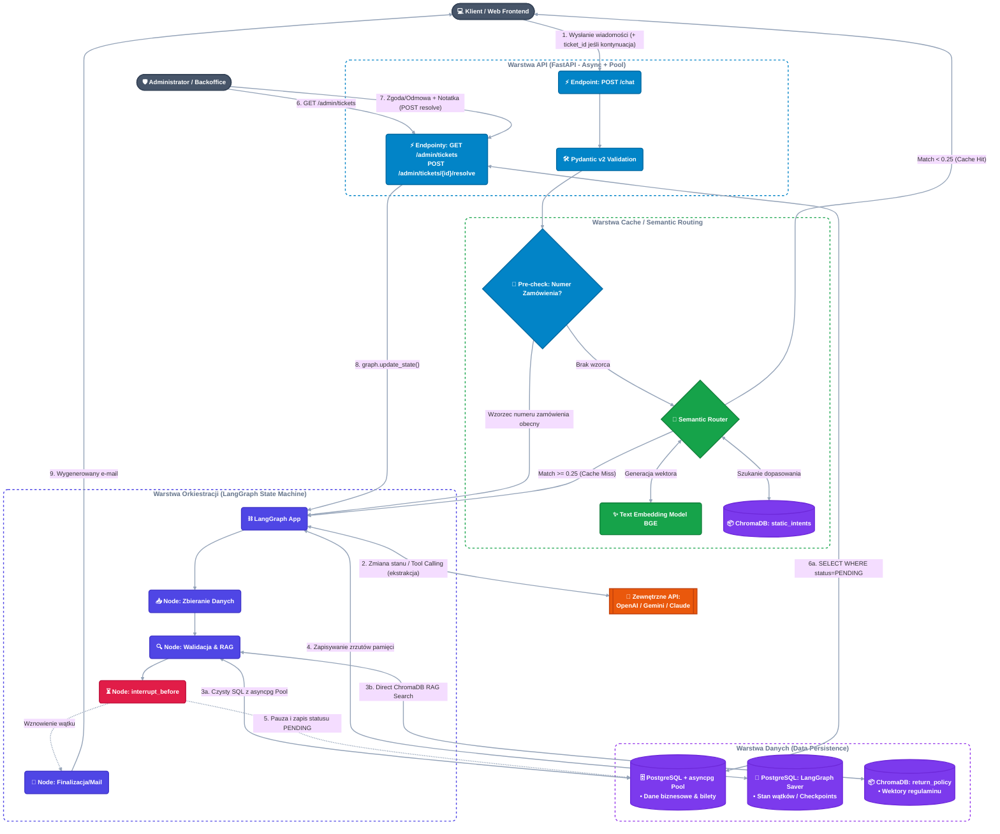

# Hybrydowy Portal Zwrotów z Semantic Routerem i HITL

[](https://www.python.org/)
[](https://fastapi.tiangolo.com/)
[](https://www.postgresql.org/)
[](https://www.trychroma.com/)
[](https://langchain-ai.github.io/langgraph/)
[](https://www.docker.com/)

Asynchroniczny, produkcyjny system do obsługi zwrotów w e-commerce. Portal wykorzystuje **Semantic Router** (ChromaDB) do przechwytywania powtarzalnych zapytań i redukcji kosztów LLM, bezpośrednie odpytywanie **ChromaDB** dla logiki RAG (Regulamin Zwrotów), **LangGraph** do orkiestracji wielokrokowego procesu zbierania danych (Slot-Filling) oraz wbudowany mechanizm **Human-In-The-Loop (HITL)** do zatwierdzania nietypowych zgłoszeń przez administratora.

Cały system działa jako deterministyczna maszyna stanów (LangGraph) — LLM jest wywoływany punktowo, wyłącznie do zadań ekstrakcji danych i formatowania tekstu, nigdy do samodzielnego decydowania o przepływie sterowania czy wykonywaniu zapytań do bazy/RAG (to zawsze bezpośrednie, deterministyczne wywołania funkcji Pythona).

---

## 🛠️ Stack Technologiczny

### 1. Backend & API (Warstwa Wejściowa)
* **Python 3.12+**: Asynchroniczność (`async`/`await`), wydajna obsługa I/O oraz pełne typowanie.
* **FastAPI**: Wysokowydajny, asynchroniczny framework do obsługi punktów końcowych dla klientów (`/chat`) oraz interfejsu administratora (`/admin`).
* **Pydantic v2**: Rygorystyczna walidacja danych wejściowych (np. format `order_id`) oraz parsowanie obiektów JSON generowanych przez modele AI.

### 2. Bazy Danych & Persystencja
* **PostgreSQL 16**: Główna relacyjna baza danych dla logiki biznesowej (`orders`, `tickets`).
* **asyncpg (z Connection Pool)**: Najszybszy, czysto asynchroniczny sterownik do Postgresa w Pythonie. Zarządzany poprzez **Pulę Połączeń (`asyncpg.Pool`)** inicjalizowaną w cyklu życia aplikacji (lifespan FastAPI), co zapobiega wyczerpaniu limitów połączeń i błędom 500 przy dużym natężeniu ruchu.
* **LangGraph AsyncPostgresSaver**: Natywny checkpointer zapisujący zserializowany stan grafu (pamięć wątku czatu) do tablic stanowych w Postgresie.
* **ChromaDB**: Wektorowa baza danych uruchamiana w kontenerze Docker, pełniąca dwie role:
  1. **Semantic Router**: Wektorowe filtry dopasowujące intencje i serwujące odpowiedzi bezpośrednio z cache.
  2. **Baza Wiedzy (RAG)**: Przechowywanie wektorów regulaminu zwrotów i bezpośrednie odpytywanie przez klient ChromaDB (bez pośrednictwa dodatkowych frameworków).

### 3. Orkiestracja AI (Mózg Systemu)
* **LangGraph**: Deterministyczna maszyna stanów definiująca przepływy pracy (zbieranie danych -> walidacja -> automatyczny zwrot LUB pauza `interrupt_before` dla admina).
* **Direct ChromaDB Querying**: Bezpośrednia integracja z ChromaDB do szybkiego wyszukiwania semantycznego zapisów regulaminu.
* **LLM Engine (OpenAI / Anthropic / Gemini)**: Wykorzystywany przez agenta wyłącznie do wnioskowania, wywoływania narzędzi (*Function Calling*) oraz formatowania ustrukturyzowanych odpowiedzi.

### 4. DevOps & Jakość Kodu
* **Docker & Docker Compose**: Pełna konteneryzacja środowiska (FastAPI, PostgreSQL, ChromaDB).
* **pytest & pytest-asyncio**: Kompleksowe testy asynchroniczne z mockowaniem LLM i weryfikacją stanu bazy.
* **Ruff & Mypy**: Linter i statyczna kontrola typów gwarantujące czystość kodu.

---

## 📂 Struktura Projektu

```
app/
├── main.py               # FastAPI: setup, lifespan (asyncpg pool + chroma client)
├── config.py              # ustawienia z .env (klucze API, DSN)
├── schemas.py              # modele Pydantic: request/response API + schemat ekstrakcji dla LLM
├── router.py               # endpointy: /chat, /admin/tickets, /admin/tickets/{id}/resolve
├── precheck.py              # deterministyczna detekcja numeru zamówienia (przed SemRouter)
├── semantic_router.py         # embedding + porównanie dystansu w ChromaDB (static_intents)
├── db/
│   └── queries.py            # zapytania SQL (asyncpg), używane zarówno przez graf jak i /admin
├── rag/
│   └── policy_search.py        # bezpośrednie zapytania RAG do kolekcji return_policy
├── graph/
│   ├── state.py               # definicja stanu grafu (w tym licznik order_id_attempts)
│   ├── nodes.py                # funkcje 4 węzłów
│   └── builder.py               # budowa + kompilacja StateGraph z checkpointerem
└── email/
    └── template.py              # statyczny szablon + pole na uzasadnienie z LLM

data/                       # surowe źródła do zaindeksowania (NIE dane runtime bazy)
scripts/                     # jednorazowe skrypty operacyjne (np. ingest_policy.py)
tests/                       # obsługiwane przez pyproject.toml
```

---
*
## 🧭 Decyzje architektoniczne (log ustaleń)

- **thread_id = ticket.id.** Jedna wartość pełni obie role: klucz główny w tabeli `tickets` (PostgreSQL) i identyfikator wątku w `AsyncPostgresSaver` (LangGraph). Świadome uproszczenie przy założeniu relacji 1:1 ticket↔wątek; brak obsługi scenariusza "klient wraca do tego samego zgłoszenia nową rozmową" — odłożone do rozważenia, jeśli pojawi się realna potrzeba.

- **Moment tworzenia ticketu.** Wiersz w `tickets` zakładany jest przy PIERWSZYM trafieniu wiadomości do grafu (Cache Miss w SemRouter lub wykryty wzorzec numeru zamówienia przez precheck), ze statusem `IN_PROGRESS` — nie dopiero po skompletowaniu wszystkich slotów. `ticket_id` (= `thread_id`) zwracany jest do klienta w odpowiedzi na pierwszą wiadomość i pełni rolę ID czatu. Frontend dołącza go do treści każdej kolejnej wiadomości w tej samej rozmowie — trzymany wyłącznie w pamięci widgetu na czas wizyty (zgodnie z zasadą braku trwałej sesji).

- **Czat bez trwałej sesji klienta** (natywny widget na stronie, jednorazowy — trwa w pamięci JS tylko przez czas wizyty, nie między wizytami). Konsekwencja: po zatwierdzeniu przez admina (HITL) system NIGDY nie wraca do okna czatu — finalizacja zawsze idzie e-mailem. `Node: Finalizacja/Mail` to jedyny kanał domknięcia sprawy po `interrupt_before`. Wynika z tego, że e-mail klienta jest obowiązkowym slotem zbieranym w `Node: Zbieranie Danych` — bez niego węzeł finalizujący nie ma gdzie wysłać odpowiedzi.

- **Pre-check numeru zamówienia** wykonywany jako osobna, deterministyczna funkcja PRZED `SemRouter` (nie jako warunek wewnątrz niego) — zero kosztu embeddingu/LLM na tym etapie, łatwa testowalność w izolacji (bez mocków ChromaDB/LLM).

- **Deterministyczny dostęp do danych w węzłach grafu (Wariant B).** `NodeVal` woła funkcje z `app/db/` i `app/rag/` bezpośrednio, jako zwykłe funkcje Pythona — NIE przez function calling LLM-a. Model nie decyduje, czy sprawdzić zamówienie w SQL czy regulamin w ChromaDB — to wykonywane jest zawsze, wynik trafia do modelu jako kontekst. Function calling / structured output LLM-a używane jest wyłącznie tam, gdzie potrzebna jest ekstrakcja lub formatowanie (Node: Zbieranie Danych, pole uzasadnienia w mailu), nigdy do decydowania o wykonaniu zapytań. Konsekwencja nazewnicza: katalog na funkcje SQL/RAG nazywa się `app/db/` i `app/rag/` (po źródle danych), NIE `tools/` — ta nazwa jest zarezerwowana semantycznie dla function-calling, którego tu nie stosujemy.

- **Reguły automatycznej kwalifikacji zwrotu (do rozstrzygnięcia w `NodeVal`).** Zgłoszenie kwalifikuje się do automatycznej realizacji (pomija HITL) tylko gdy spełnione są WSZYSTKIE warunki: (1) zakup nie starszy niż 14 dni, (2) kwota zwrotu ≤ 600 zł, (3) powód zwrotu znajduje się na zamkniętej liście dozwolonych powodów standardowych — **⚠️ TODO: pełna lista do uzupełnienia przez ucznia przed Fazą 4** (obecnie tylko przykład: "zbyt mały rozmiar"), (4) numer zamówienia został poprawnie zweryfikowany w bazie, (5) limit prób podania poprawnego numeru zamówienia nieprzekroczony (zob. niżej). Niespełnienie któregokolwiek warunku → `interrupt_before` → HITL.

- **Limit prób podania poprawnego numeru zamówienia.** Licznik `order_id_attempts` w stanie grafu, inkrementowany deterministycznie w kodzie (nie przez LLM) po każdej nieudanej weryfikacji w SQL. Po przekroczeniu progu (proponowana wartość startowa: **2 nieudane próby** — do potwierdzenia/dostosowania) sprawa automatycznie trafia do HITL. LLM odpowiada wyłącznie za konwersacyjną prośbę o korektę i ekstrakcję nowej wartości — decyzja o eskalacji to zwykły warunek w kodzie (`if order_id_attempts >= próg`), nie "rozumowanie" modelu. To NIE jest mechanizm agentowy, mimo że z perspektywy rozmowy wygląda na dynamiczny — to licznik i próg jak w każdej innej regule kwalifikacji.

- **Szablon e-maila finalizującego** ma być statyczny (stała struktura), LLM wypełnia wyłącznie pole z uzasadnieniem decyzji — nie generuje całej wiadomości od zera.

- **Endpoint admina do listowania zgłoszeń.** `GET /admin/tickets` zwraca zgłoszenia (domyślnie status `PENDING`, docelowo z możliwością filtrowania po statusie — zob. niżej `FAILED_DELIVERY`) — panel admina nigdy nie łączy się z bazą bezpośrednio, zawsze przez API (poprawione też na diagramie w README.md, gdzie wcześniej sugerował bezpośredni odczyt bazy).

- **Logi aplikacji — brak folderu `logs/` w repozytorium.** Zgodnie z zasadą traktowania logów jako strumienia zdarzeń (12-factor app), aplikacja loguje na stdout/stderr — infrastruktura (Docker, docelowo system agregacji typu Loki/CloudWatch) odpowiada za ich zbieranie. Struktura logu: poziom, timestamp, `thread_id` (gdzie dotyczy), kontekst operacji. Konfiguracja loggera (`app/logging_config.py`) odłożona do momentu realnej potrzeby (Faza 3/4), nie tworzona "na zapas" w Fazie 1.

- **Strategia obsługi błędów zewnętrznych zależności.** Postgres/ChromaDB: retry (kilka prób, krótkie odczekiwanie) wyłącznie w fazie startu aplikacji (`lifespan`) — zabezpieczenie przed wyścigiem startowym kontenerów Docker Compose. Poza startem (w trakcie obsługi żądań): fail-fast, natychmiastowy log z kontekstem (`thread_id`, operacja, wyjątek), bez automatycznego ponawiania — traktowane jako awaria systemowa wymagająca interwencji. API LLM: automatyczny retry z exponential backoff, max 3 próby w budżecie czasowym ~8-10s, stosowany WYŁĄCZNIE dla enumerowanej listy kodów błędów przejściowych (429, 5xx, timeout sieciowy); pozostałe kody (400/401/403/422 i inne błędy trwałe) idą od razu do fail-fast, bez próby ponawiania. Wspólna logika retry (np. przez bibliotekę `tenacity`) używana jednym mechanizmem we wszystkich wywołaniach LLM w projekcie, nie duplikowana per węzeł.

- **Idempotencja wysyłki e-maila (`Node: Finalizacja/Mail`).** Wywołanie LLM po tekst uzasadnienia jest bezstanowe i bezpieczne do retry. Faktyczna wysyłka e-maila NIE jest bezpiecznie retry'owalna wprost (ryzyko podwójnej wysyłki tej samej decyzji do klienta) — przed wysyłką węzeł sprawdza aktualny status ticketu w Postgresie; jeśli już `RESOLVED`, pomija ponowną wysyłkę. Status aktualizowany na `RESOLVED` dopiero PO potwierdzonym sukcesie wysyłki, nigdy przed.

- **Trwała awaria wysyłki po zatwierdzeniu przez admina.** Jeśli generowanie uzasadnienia lub wysyłka maila ostatecznie zawiedzie mimo wyczerpania prób retry, ticket NIE wraca automatycznie do kolejki `PENDING` (myliłoby to admina, sugerując nowe zgłoszenie do oceny, i mogłoby tworzyć pętlę przy trwałej awarii). Zamiast tego przyjmuje osobny status `FAILED_DELIVERY`, wymagający ręcznego ponowienia po stronie admina/operatora po ustaniu przyczyny awarii infrastruktury (np. dostawca poczty wrócił do działania).


---

## 🏗️ Architektura Systemu



---