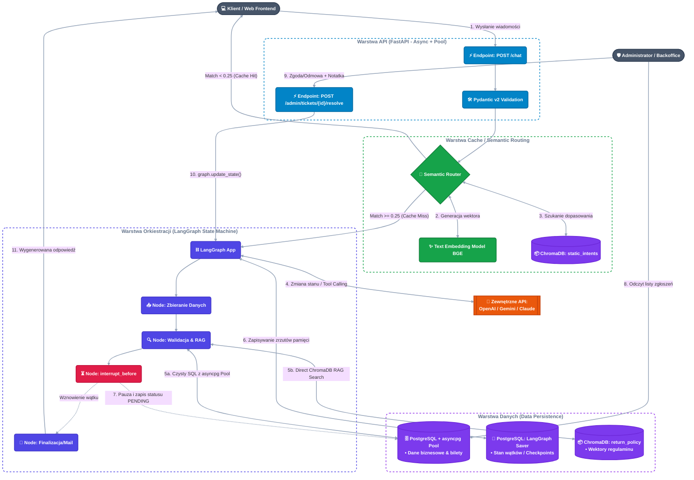

# Hybrydowy Portal Zwrotów z Semantic Routerem i HITL

Asynchroniczny, produkcyjny system do obsługi zwrotów w e-commerce. Portal wykorzystuje **Semantic Router** (ChromaDB) do przechwytywania powtarzalnych zapytań i redukcji kosztów LLM, bezpośrednie odpytywanie **ChromaDB** dla logiki RAG (Regulamin Zwrotów), **LangGraph** do orkiestracji wielokrokowego procesu zbierania danych (Slot-Filling) oraz wbudowany mechanizm **Human-In-The-Loop (HITL)** do zatwierdzania nietypowych zgłoszeń przez administratora.

---

## 🛠️ Stack Technologiczny

### 1. Backend & API (Warstwa Wejściowa)
* **Python 3.12+**: Asynchroniczność (`async`/`await`), wydajna obsługa I/O oraz pełne typowanie.
* **FastAPI**: Wysokowydajny, asynchroniczny framework do obsługi punktów końcowych dla klientów (`/chat`) oraz interfejsu administratora (`/admin`).
* **Pydantic v2**: Rygorystyczna walidacja danych wejściowych (np. format `order_id`) oraz parsowanie obiektów JSON generowanych przez modele AI.

### 2. Bazy Danych & Persystencja
* **PostgreSQL 16**: Główna relacyjna baza danych dla logiki biznesowej (`orders`, `tickets`).
* **asyncpg (z Connection Pool)**: Najszybszy, czysto asynchroniczny sterownik do Postgresa w Pythonie. Zarządzany poprzez **Pulę Połączeń (`asyncpg.Pool`)** inicjalizowaną w cyklu życia aplikacji (lifespan FastAPI), co zapobiega wyczerpaniu limitów połączeń i błędom 500 przy dużym natężeniu ruchu.
* **LangGraph AsyncPostgresSaver**: Natywny checkpointer zapisujący zserializowany stan grafu (pamięć wątku czatu) do tablic stanowych w Postgresie.
* **ChromaDB**: Wektorowa baza danych uruchamiana w kontenerze Docker, pełniąca dwie role:
  1. **Semantic Router**: Wektorowe filtry dopasowujące intencje i serwujące odpowiedzi bezpośrednio z cache.
  2. **Baza Wiedzy (RAG)**: Przechowywanie wektorów regulaminu zwrotów i bezpośrednie odpytywanie przez klient ChromaDB (bez pośrednictwa dodatkowych frameworków).

### 3. Orkiestracja AI (Mózg Systemu)
* **LangGraph**: Deterministyczna maszyna stanów definiująca przepływy pracy (zbieranie danych -> walidacja -> automatyczny zwrot LUB pauza `interrupt_before` dla admina).
* **Direct ChromaDB Querying**: Bezpośrednia integracja z ChromaDB do szybkiego wyszukiwania semantycznego zapisów regulaminu.
* **LLM Engine (OpenAI / Anthropic / Gemini)**: Wykorzystywany przez agenta wyłącznie do wnioskowania, wywoływania narzędzi (*Function Calling*) oraz formatowania ustrukturyzowanych odpowiedzi.

### 4. DevOps & Jakość Kodu
* **Docker & Docker Compose**: Pełna konteneryzacja środowiska (FastAPI, PostgreSQL, ChromaDB).
* **pytest & pytest-asyncio**: Kompleksowe testy asynchroniczne z mockowaniem LLM i weryfikacją stanu bazy.
* **Ruff & Mypy**: Linter i statyczna kontrola typów gwarantujące czystość kodu.

---

## 🏗️ Architektura Systemu

---