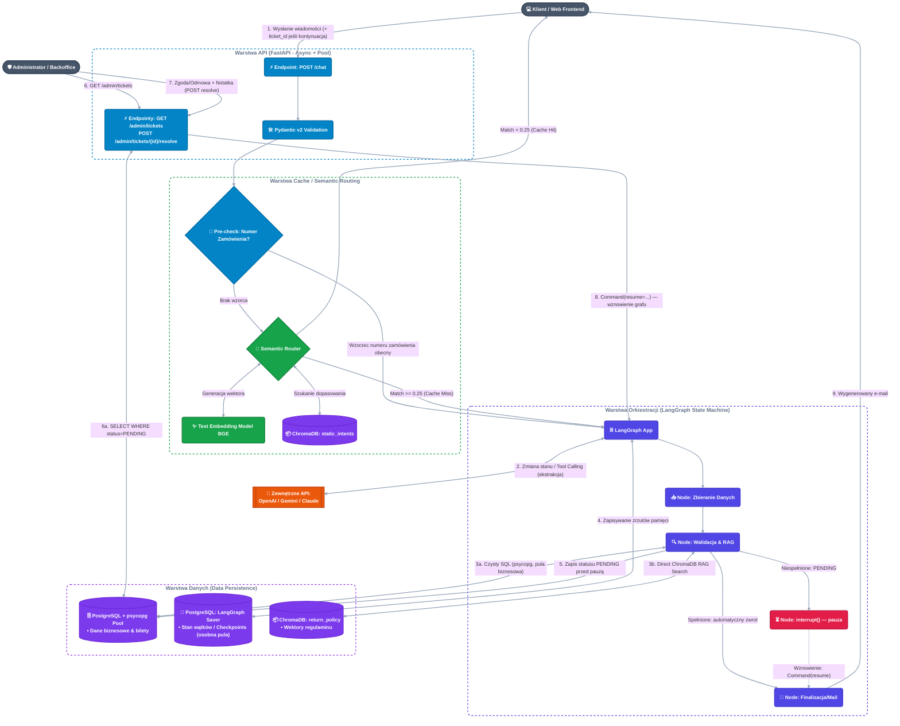

# Hybrydowy Portal Zwrotów z Semantic Routerem i HITL

[](https://www.python.org/)
[](https://fastapi.tiangolo.com/)
[](https://www.postgresql.org/)
[](https://www.trychroma.com/)
[](https://langchain-ai.github.io/langgraph/)
[](https://www.docker.com/)

Asynchroniczny, produkcyjny system do obsługi zwrotów w e-commerce. Portal wykorzystuje **Semantic Router** (ChromaDB) do przechwytywania powtarzalnych zapytań i redukcji kosztów LLM, bezpośrednie odpytywanie **ChromaDB** dla logiki RAG (Regulamin Zwrotów), **LangGraph** do orkiestracji wielokrokowego procesu zbierania danych (Slot-Filling) oraz wbudowany mechanizm **Human-In-The-Loop (HITL)** do zatwierdzania nietypowych zgłoszeń przez administratora.

Cały system działa jako deterministyczna maszyna stanów (LangGraph) — LLM jest wywoływany punktowo, wyłącznie do zadań ekstrakcji danych i formatowania tekstu, nigdy do samodzielnego decydowania o przepływie sterowania czy wykonywaniu zapytań do bazy/RAG (to zawsze bezpośrednie, deterministyczne wywołania funkcji Pythona).

Wersje zależności zweryfikowane w audycie z 24.09.2026 (zob. `pyproject.toml`, `uv.lock`).

---

## 🛠️ Stack Technologiczny

### 1. Backend & API (Warstwa Wejściowa)
* **Python 3.12+**: Asynchroniczność (`async`/`await`), wydajna obsługa I/O oraz pełne typowanie.
* **FastAPI**: Wysokowydajny, asynchroniczny framework do obsługi punktów końcowych dla klientów (`/chat`) oraz interfejsu administratora (`/admin`).
* **Pydantic v2**: Rygorystyczna walidacja danych wejściowych (np. format `order_id`, format e-maila) oraz parsowanie obiektów JSON generowanych przez modele AI. Reguły spójności danych egzekwowane są też w bazie (zob. Schemat bazy).

### 2. Bazy Danych & Persystencja
* **PostgreSQL 16**: Główna relacyjna baza danych dla logiki biznesowej (`orders`, `tickets`).
* **psycopg 3 (async, z pulą `psycopg_pool`)**: Jedyny sterownik Postgresa w projekcie. Pula biznesowa (`AsyncConnectionPool`) inicjalizowana w cyklu życia aplikacji (lifespan FastAPI), co zapobiega wyczerpaniu limitów połączeń i błędom 500 przy dużym natężeniu ruchu. Zapytania w składni `%s`, parametry zawsze wiązane po stronie serwera (bez sklejania SQL-a tekstem).
* **Alembic**: Wersjonowane, odtwarzalne migracje schematu. Bez ORM: migracje piszemy ręcznie (`upgrade()` / `downgrade()` z surowym SQL-em). Migracje obejmują wyłącznie tabele biznesowe.
* **LangGraph AsyncPostgresSaver** (`langgraph-checkpoint-postgres`): Natywny checkpointer zapisujący zserializowany stan grafu (pamięć wątku czatu) do tablic stanowych w Postgresie. Wymaga połączeń w trybie autocommit z `dict_row`, dlatego ma **osobną pulę** (`psycopg_pool`), oddzieloną od puli biznesowej. Tabele tworzy jego własny `setup()`, poza Alembikiem.
* **ChromaDB**: Wektorowa baza danych uruchamiana w kontenerze Docker, pełniąca dwie role:
  1. **Semantic Router**: Wektorowe filtry dopasowujące intencje i serwujące odpowiedzi bezpośrednio z cache.
  2. **Baza Wiedzy (RAG)**: Przechowywanie wektorów regulaminu zwrotów i bezpośrednie odpytywanie przez klient ChromaDB (bez pośrednictwa dodatkowych frameworków).

### 3. Orkiestracja AI (Mózg Systemu)
* **LangGraph 1.x**: Deterministyczna maszyna stanów definiująca przepływy pracy (zbieranie danych -> walidacja -> automatyczny zwrot LUB pauza `interrupt()` dla admina; wznowienie przez `Command(resume=...)`).
* **Direct ChromaDB Querying**: Bezpośrednia integracja z ChromaDB do szybkiego wyszukiwania semantycznego zapisów regulaminu.
* **LLM Engine (OpenAI / Anthropic / Gemini)**: Wykorzystywany przez agenta wyłącznie do wnioskowania, wywoływania narzędzi (*Function Calling*) oraz formatowania ustrukturyzowanych odpowiedzi.

### 4. DevOps & Jakość Kodu
* **Docker & Docker Compose**: Pełna konteneryzacja środowiska (FastAPI, PostgreSQL, ChromaDB).
* **pytest & pytest-asyncio**: Kompleksowe testy asynchroniczne z mockowaniem LLM i weryfikacją stanu bazy.
* **Ruff & Mypy**: Linter i statyczna kontrola typów gwarantujące czystość kodu.

---

## 📂 Struktura Projektu

```
app/
├── main.py               # FastAPI: setup, lifespan (pula psycopg + osobna pula checkpointera + chroma client)
├── config.py              # ustawienia z .env (klucze API, DSN)
├── schemas.py              # modele Pydantic: request/response API + schemat ekstrakcji dla LLM
├── router.py               # endpointy: /chat, /admin/tickets, /admin/tickets/{id}/resolve
├── precheck.py              # deterministyczna detekcja numeru zamówienia (przed SemRouter)
├── semantic_router.py         # embedding + porównanie dystansu w ChromaDB (static_intents)
├── db/
│   └── queries.py            # zapytania SQL (psycopg), używane zarówno przez graf jak i /admin
├── rag/
│   └── policy_search.py        # bezpośrednie zapytania RAG do kolekcji return_policy
├── graph/
│   ├── state.py               # definicja stanu grafu (w tym licznik order_id_attempts)
│   ├── nodes.py                # funkcje 4 węzłów (w tym NodeHITL: sama pauza interrupt())
│   └── builder.py               # budowa + kompilacja StateGraph z checkpointerem
└── email/
    └── template.py              # statyczny szablon + pole na uzasadnienie z LLM

migrations/                 # migracje Alembic (tabele biznesowe, bez tabel checkpointera)
data/                       # surowe źródła do zaindeksowania (NIE dane runtime bazy)
scripts/                     # jednorazowe skrypty operacyjne (np. ingest_policy.py)
tests/                       # obsługiwane przez pyproject.toml
```

---

## 🗄️ Schemat bazy (pierwsza migracja)

Pierwsza migracja Alembika zastępuje dotychczasowy `scripts/create_table.sql`. Odtwarzalna jedną komendą od zera.

**Typy enum:**
- `shipped_status_enum`: `UNSENT`, `SENT`, `DELIVERED`
- `return_status_enum`: `IN_PROGRESS`, `PENDING`, `PROCESSING_RESOLUTION`, `RESOLVED`, `FAILED_DELIVERY`

**Tabela `orders`:**

| Kolumna | Typ | Ograniczenia |
|---|---|---|
| `order_id` | INT | klucz główny |
| `amount` | DECIMAL(10,2) | NOT NULL |
| `user_email` | VARCHAR(255) | NOT NULL |
| `product_name` | VARCHAR(255) | NOT NULL |
| `shipped_status` | `shipped_status_enum` | NOT NULL, domyślnie `UNSENT` |
| `order_date` | DATE | NOT NULL (data zamówienia) |
| `delivered_at` | TIMESTAMPTZ | NULL do momentu dostawy; CHECK: `DELIVERED` wymaga wypełnionej wartości |

**Tabela `tickets`:**

| Kolumna | Typ | Ograniczenia |
|---|---|---|
| `thread_id` | INT (identity) | klucz główny; w checkpointerze używany jako `str(ticket.id)` |
| `order_id` | INT | NULL, klucz obcy do `orders` (ON DELETE SET NULL) |
| `contact_email` | VARCHAR(255) | NULL (pusty do momentu podania adresu) |
| `return_status` | `return_status_enum` | NOT NULL, domyślnie `IN_PROGRESS` |
| `return_reason` | TEXT | NULL |
| `admin_note` | TEXT | NULL |
| `created_at` | TIMESTAMPTZ | domyślnie bieżący czas |

**CHECK na `tickets`:** `return_status = 'IN_PROGRESS'` albo `contact_email IS NOT NULL`. Dla statusów innych niż `IN_PROGRESS` (w tym `PROCESSING_RESOLUTION`, `FAILED_DELIVERY`) e-mail jest wymagany. Predykat `IS NOT NULL` jest celowy: porównanie typu `contact_email <> ''` dla NULL daje NULL, a Postgres traktuje to jako spełnione.

---

## 🧭 Decyzje architektoniczne (log ustaleń)

- **thread_id = ticket.id.** Jedna wartość pełni obie role: klucz główny w tabeli `tickets` (PostgreSQL) i identyfikator wątku w `AsyncPostgresSaver` (LangGraph), przekazywany jako `str(ticket.id)` przez jeden helper. Kolumna `thread_id` w tabelach checkpointera jest `TEXT`, więc konwersja jest konieczna. Brak klucza obcego między `tickets` a tabelami checkpointera, spójność trzymana konwencją w kodzie. Świadome uproszczenie przy założeniu relacji 1:1 ticket↔wątek; brak obsługi scenariusza "klient wraca do tego samego zgłoszenia nową rozmową" — odłożone do rozważenia, jeśli pojawi się realna potrzeba.

- **Moment tworzenia ticketu.** Wiersz w `tickets` zakładany jest przy PIERWSZYM trafieniu wiadomości do grafu (Cache Miss w SemRouter lub wykryty wzorzec numeru zamówienia przez precheck), ze statusem `IN_PROGRESS` — nie dopiero po skompletowaniu wszystkich slotów. `ticket_id` (= `thread_id`) zwracany jest do klienta w odpowiedzi na pierwszą wiadomość i pełni rolę ID czatu. Frontend dołącza go do treści każdej kolejnej wiadomości w tej samej rozmowie — trzymany wyłącznie w pamięci widgetu na czas wizyty (zgodnie z zasadą braku trwałej sesji).

- **Czat bez trwałej sesji klienta** (natywny widget na stronie, jednorazowy — trwa w pamięci JS tylko przez czas wizyty, nie między wizytami). Konsekwencja: po zatwierdzeniu przez admina (HITL) system NIGDY nie wraca do okna czatu — finalizacja zawsze idzie e-mailem. `Node: Finalizacja/Mail` to jedyny kanał domknięcia sprawy po `interrupt()`. Wynika z tego, że e-mail klienta jest obowiązkowym slotem zbieranym w `Node: Zbieranie Danych` — bez niego węzeł finalizujący nie ma gdzie wysłać odpowiedzi.

- **Pre-check numeru zamówienia** wykonywany jako osobna, deterministyczna funkcja PRZED `SemRouter` (nie jako warunek wewnątrz niego) — zero kosztu embeddingu/LLM na tym etapie, łatwa testowalność w izolacji (bez mocków ChromaDB/LLM).

- **Deterministyczny dostęp do danych w węzłach grafu (Wariant B).** `NodeVal` woła funkcje z `app/db/` i `app/rag/` bezpośrednio, jako zwykłe funkcje Pythona — NIE przez function calling LLM-a. Model nie decyduje, czy sprawdzić zamówienie w SQL czy regulamin w ChromaDB — to wykonywane jest zawsze, wynik trafia do modelu jako kontekst. Function calling / structured output LLM-a używane jest wyłącznie tam, gdzie potrzebna jest ekstrakcja lub formatowanie (Node: Zbieranie Danych, pole uzasadnienia w mailu), nigdy do decydowania o wykonaniu zapytań. Konsekwencja nazewnicza: katalog na funkcje SQL/RAG nazywa się `app/db/` i `app/rag/` (po źródle danych), NIE `tools/` — ta nazwa jest zarezerwowana semantycznie dla function-calling, którego tu nie stosujemy.

- **Wybór sterownika Postgresa: psycopg 3 wszędzie (wariant A).** Checkpointer LangGraph wymaga psycopg 3, więc ten sterownik i tak jest w projekcie; dokładanie asyncpg dawałoby dwa API, dwie semantyki błędów i dwa dialekty parametrów. Koszt zmiany był zerowy, bo `app/db/` nie zawierało jeszcze kodu. Przewaga asyncpg w wydajności dotyczy mikrobenchmarków, a czas odpowiedzi systemu zdominowany jest przez LLM. Odrzucony wariant B: asyncpg dla logiki biznesowej + psycopg dla checkpointera.

- **Dwie pule, jeden sterownik.** Pula biznesowa (`psycopg_pool.AsyncConnectionPool`, lifespan FastAPI) i osobna pula checkpointera. Checkpointer wymaga autocommit i `dict_row`, więc jego konfiguracja nie może wpływać na zachowanie transakcji zapytań biznesowych. Budżet połączeń Postgresa to suma obu pul.

- **Migracje: Alembic bez ORM.** Schemat wersjonowany i odtwarzalny, zapytania pozostają surowym SQL-em w `app/db/queries.py`. SQLAlchemy jest w lockfile jako zależność Alembica, ale nie jest używane w kodzie aplikacji. Tabele checkpointera nie są częścią migracji.

- **Reguły automatycznej kwalifikacji zwrotu (odpowiedzialność `NodeVal`).** Zgłoszenie kwalifikuje się do automatycznej realizacji (pomija HITL) tylko gdy łącznie spełnione są WSZYSTKIE warunki: (1) zgłoszenie utworzone nie później niż 14 dni od dnia dostarczenia produktu (`orders.delivered_at`), (2) kwota zwrotu ≤ 600 zł, (3) powód zwrotu znajduje się na zamkniętej liście dozwolonych powodów standardowych zgodnej z §3 regulaminu, (4) status przesyłki to `DELIVERED`. Niespełnienie któregokolwiek warunku → zapis statusu `PENDING` → `interrupt()` → HITL.

- **Warunki wejścia do `NodeVal` (odpowiedzialność `NodeGather`).** Zanim graf przekaże kontrolę do `NodeVal`, muszą być spełnione: (1) numer zamówienia został poprawnie zweryfikowany w bazie (istnieje rekord w `orders`), (2) limit prób podania poprawnego numeru nieprzekroczony. To NIE są warunki merytoryczne zwrotu — `NodeVal` zakłada ich spełnienie i nie weryfikuje ich ponownie.

- **Limit prób podania poprawnego numeru zamówienia.** Licznik `order_id_attempts` w stanie grafu, inkrementowany deterministycznie w kodzie (nie przez LLM) po każdej nieudanej weryfikacji w SQL. Próg: **3 nieudane próby**. Po jego przekroczeniu sprawa trafia do HITL, ale tylko wtedy, gdy e-mail jest już zebrany (zob. następna decyzja). LLM odpowiada wyłącznie za konwersacyjną prośbę o korektę i ekstrakcję nowej wartości — decyzja o eskalacji to zwykły warunek w kodzie (`if order_id_attempts >= próg`), nie "rozumowanie" modelu.

- **Eskalacja HITL bez skompletowanego e-maila.** Ticket istnieje od pierwszej wiadomości (status `IN_PROGRESS`). Jeśli licznik przekroczy próg, a slot e-maila jest pusty, `NodeGather` nie zmienia statusu na `PENDING` — dopytuje jednorazowo, jednoznacznie o e-mail, i dopiero po jego otrzymaniu eskaluje. Zapobiega to naruszeniu `CHECK` na `tickets` oraz sytuacji, w której admin dostaje zgłoszenie bez kanału odpowiedzi do klienta.

- **Odpowiedź klienta niebędąca e-mailem.** Slot e-maila jest opcjonalny w ekstrakcji: niepoprawna odpowiedź daje `None`, slot zostaje pusty, a `NodeGather` zadaje pytanie ponownie. Ticket pozostaje w `IN_PROGRESS`, a bot informuje wprost, że bez adresu zgłoszenie nie zostanie przekazane dalej. Brak osobnego licznika; klient, który nigdy nie poda adresu, trafia do Known Limitations.

- **HITL na `interrupt()` zamiast `interrupt_before`.** `NodeHITL` zawiera wyłącznie wywołanie `interrupt()`, a zapis statusu `PENDING` wykonuje się w `NodeVal` PRZED pauzą. Powód: po wznowieniu przez `Command(resume=...)` węzeł wykonuje się od początku, więc kod przed `interrupt()` uruchomiłby się ponownie (np. zapis statusu lub zapytania SQL). Endpoint `POST /admin/tickets/{id}/resolve` wznawia graf przez `Command(resume=...)`, zamiast `graph.update_state()`. Wartości przekazywane przez admina (decyzja, notatka) ustalane są przy implementacji endpointu.

- **Endpoint admina do listowania zgłoszeń.** `GET /admin/tickets` zwraca zgłoszenia (domyślnie status `PENDING`, docelowo z możliwością filtrowania po statusie — zob. niżej `FAILED_DELIVERY`) — panel admina nigdy nie łączy się z bazą bezpośrednio, zawsze przez API.

- **Szablon e-maila finalizującego** ma być statyczny (stała struktura), LLM wypełnia wyłącznie pole z uzasadnieniem decyzji — nie generuje całej wiadomości od zera.

- **Idempotencja wysyłki e-maila (`Node: Finalizacja/Mail`).** Wywołanie LLM po tekst uzasadnienia jest bezstanowe i bezpieczne do retry. Faktyczna wysyłka e-maila NIE jest bezpiecznie retry'owalna wprost (ryzyko podwójnej wysyłki tej samej decyzji do klienta) — przed wysyłką węzeł sprawdza aktualny status ticketu w Postgresie; jeśli już `RESOLVED`, pomija ponowną wysyłkę. Status aktualizowany na `RESOLVED` dopiero PO potwierdzonym sukcesie wysyłki, nigdy przed. Status `PROCESSING_RESOLUTION` oznacza stan między wysyłką a zapisem i wymaga tej samej ochrony.

- **Trwała awaria wysyłki po zatwierdzeniu przez admina.** Jeśli generowanie uzasadnienia lub wysyłka maila ostatecznie zawiedzie mimo wyczerpania prób retry, ticket NIE wraca automatycznie do kolejki `PENDING` (myliłoby to admina, sugerując nowe zgłoszenie do oceny, i mogłoby tworzyć pętlę przy trwałej awarii). Zamiast tego przyjmuje osobny status `FAILED_DELIVERY`, wymagający ręcznego ponowienia po stronie admina/operatora po ustaniu przyczyny awarii infrastruktury.

- **Ekstrakcja oportunistyczna slotów w `Node: Zbieranie Danych`.** Węzeł nie pyta o sloty sekwencyjnie, tylko przy każdym wywołaniu próbuje wyciągnąć z bieżącej wiadomości wszystkie trzy sloty naraz (`order_id`, `email`, `reason`). Schemat ekstrakcji Pydantic ma wszystkie pola jako `Optional` — LLM zwraca `None` dla slotu, którego nie da się wyciągnąć, zamiast go halucynować. Kod (nie LLM) scala wynik ze stanem grafu, nadpisując wyłącznie puste pola. Dopiero po scaleniu węzeł deterministycznie sprawdza, których slotów brakuje, i pyta tylko o nie.

- **`order_id` jest polem "zamrożonym" po pozytywnej weryfikacji w bazie** — kolejny, inny numer zamówienia w tej samej rozmowie jest ignorowany, a pierwszy zweryfikowany numer jest wiążący dla całej rozmowy.

- **Logi aplikacji — brak folderu `logs/` w repozytorium.** Zgodnie z zasadą traktowania logów jako strumienia zdarzeń (12-factor app), aplikacja loguje na stdout/stderr — infrastruktura odpowiada za ich zbieranie. Struktura logu: poziom, timestamp, `thread_id` (gdzie dotyczy), kontekst operacji. Konfiguracja loggera odłożona do momentu realnej potrzeby (Faza 3/4).

- **Strategia obsługi błędów zewnętrznych zależności.** Postgres/ChromaDB: retry (kilka prób, krótkie odczekiwanie) wyłącznie w fazie startu aplikacji (`lifespan`) — zabezpieczenie przed wyścigiem startowym kontenerów Docker Compose. Poza startem (w trakcie obsługi żądań): fail-fast, natychmiastowy log z kontekstem (`thread_id`, operacja, wyjątek), bez automatycznego ponawiania — traktowane jako awaria systemowa wymagająca interwencji. API LLM: automatyczny retry z exponential backoff, max 3 próby w budżecie czasowym ~8-10s, stosowany WYŁĄCZNIE dla enumerowanej listy kodów błędów przejściowych (429, 5xx, timeout sieciowy); pozostałe kody (400/401/403/422 i inne błędy trwałe) idą od razu do fail-fast. Wspólna logika retry (biblioteka `tenacity`) używana jednym mechanizmem we wszystkich wywołaniach LLM w projekcie, nie duplikowana per węzeł.

- **Uruchamianie lokalne na Windowsie.** psycopg async wymaga `SelectorEventLoop`, a domyślna pętla Windowsa to `ProactorEventLoop`. Lokalny start: `uvicorn app.main:app --reload --loop asyncio:SelectorEventLoop` (do przetestowania z `--reload`). Obejście przez `asyncio.set_event_loop_policy` przestało działać od uvicorn 0.36. Linux i Docker nie wymagają tej flagi.

---

## ⚠️ Technical Debt & Known Limitations

- **Brak wykrywania porzuconych stanów pośrednich.** Dwie kategorie rekordów mogą bezterminowo utknąć bez automatycznej reakcji systemu:
  - (a) `PROCESSING_RESOLUTION` — proces padł między wysyłką e-maila a zapisem statusu;
  - (b) `IN_PROGRESS` — klient porzucił rozmowę przed skompletowaniem slotów, np. nie podał e-maila po eskalacji licznika prób lub odpowiadał czymś, co nie jest adresem.

  Zaprojektowane, niezaimplementowane rozwiązanie: kolumna znacznika czasu ostatniej aktywności na `tickets` oraz okresowy skan tabeli (np. przy starcie aplikacji w `lifespan`). Reakcja różni się per kategoria: `PROCESSING_RESOLUTION` po przekroczeniu progu kwalifikuje się do ponowienia (dane są kompletne, to awaria procesu); `IN_PROGRESS` po przekroczeniu dłuższego progu jest oznaczany nowym statusem wygaśnięcia (dane nigdy nie były kompletne, nie ma czego wznawiać) — wymaga rozszerzenia enuma. Świadomie odłożone na rzecz dowiezienia kluczowej wartości biznesowej (Faza 4). Dodanie kolumny to zwykła migracja Alembika.

---

## 🏗️ Architektura Systemu


```mermaid
%%{init: {
  'theme': 'base',
  'themeVariables': {
    'fontSize': '14px',
    'subgraphTitleColor': '#64748b'
  }
}}%%
flowchart TD
    classDef actorStyle fill:#475569,stroke:#334155,stroke-width:2px,color:#ffffff,font-weight:bold,font-size:14px;
    classDef apiStyle fill:#0284c7,stroke:#0369a1,stroke-width:2px,color:#ffffff,font-weight:bold,font-size:14px;
    classDef routerStyle fill:#16a34a,stroke:#15803d,stroke-width:2px,color:#ffffff,font-weight:bold,font-size:14px;
    classDef agentStyle fill:#4f46e5,stroke:#4338ca,stroke-width:2px,color:#ffffff,font-weight:bold,font-size:14px;
    classDef dbStyle fill:#7c3aed,stroke:#6d28d9,stroke-width:2px,color:#ffffff,font-weight:bold,font-size:14px;
    classDef externalStyle fill:#ea580c,stroke:#c2410c,stroke-width:2px,color:#ffffff,font-weight:bold,font-size:14px;
    classDef hitlStyle fill:#e11d48,stroke:#be123c,stroke-width:2px,color:#ffffff,font-weight:bold,font-size:14px;

    Client(["💻 Klient / Web Frontend"])
    Admin(["🛡️ Administrator / Backoffice"])
    class Client,Admin actorStyle;

    subgraph API_Layer ["<span style='font-size:15px; font-weight:bold; color:#64748b;'>Warstwa API (FastAPI - Async + Pool)</span>"]
        style API_Layer fill:none,stroke:#0284c7,stroke-width:2px,stroke-dasharray: 5 5,rx:10px
        RouterChat("⚡ Endpoint: POST /chat")
        RouterAdmin("⚡ Endpointy: GET /admin/tickets<br/>POST /admin/tickets/{id}/resolve")
        PydanticVal("🛠️ Pydantic v2 Validation")
    end
    class RouterChat,RouterAdmin,PydanticVal apiStyle;

    subgraph Router_Layer ["<span style='font-size:15px; font-weight:bold; color:#64748b;'>Warstwa Cache / Semantic Routing</span>"]
        style Router_Layer fill:none,stroke:#16a34a,stroke-width:2px,stroke-dasharray: 5 5,rx:10px
        PreCheck{"🔎 Pre-check: Numer Zamówienia?"}
        SemRouter{"🧠 Semantic Router"}
        EmbedModel("✨ Text Embedding Model BGE")
        DBVectorIntents[("📦 ChromaDB: static_intents")]
    end
    class PreCheck apiStyle;
    class SemRouter,EmbedModel routerStyle;
    class DBVectorIntents dbStyle;

    subgraph Graph_Layer ["<span style='font-size:15px; font-weight:bold; color:#64748b;'>Warstwa Orkiestracji (LangGraph State Machine)</span>"]
        style Graph_Layer fill:none,stroke:#4f46e5,stroke-width:2px,stroke-dasharray: 5 5,rx:10px
        Graph("⛓️ LangGraph App")
        NodeGather("📥 Node: Zbieranie Danych")
        NodeVal("🔍 Node: Walidacja & RAG")
        NodeHITL("⏳ Node: interrupt() — pauza")
        NodeFinal("📧 Node: Finalizacja/Mail")
        Graph --> NodeGather
        NodeGather --> NodeVal
        NodeVal -->|"Spełnione: automatyczny zwrot"| NodeFinal
        NodeVal -->|"Niespełnione: PENDING"| NodeHITL
        NodeHITL -.->|"Wznowienie: Command(resume)"| NodeFinal
    end
    class Graph,NodeGather,NodeVal,NodeFinal agentStyle;
    class NodeHITL hitlStyle;

    subgraph DB_Layer ["<span style='font-size:15px; font-weight:bold; color:#64748b;'>Warstwa Danych (Data Persistence)</span>"]
        style DB_Layer fill:none,stroke:#9333ea,stroke-width:2px,stroke-dasharray: 5 5,rx:10px
        DBSQL[("🗄️ PostgreSQL + psycopg Pool<br/>• Dane biznesowe & bilety")]
        DBCheckpoints[("💾 PostgreSQL: LangGraph Saver<br/>• Stan wątków / Checkpoints (osobna pula)")]
        DBVectorDocs[("📦 ChromaDB: return_policy<br/>• Wektory regulaminu")]
    end
    class DBSQL,DBCheckpoints,DBVectorDocs dbStyle;

    LLM[["🤖 Zewnętrzne API:<br/>OpenAI / Gemini / Claude"]]
    class LLM externalStyle;

    Client -->|"1. Wysłanie wiadomości (+ ticket_id jeśli kontynuacja)"| RouterChat
    RouterChat --> PydanticVal
    PydanticVal --> PreCheck

    PreCheck -->|"Wzorzec numeru zamówienia obecny"| Graph
    PreCheck -->|"Brak wzorca"| SemRouter

    SemRouter <-->|"Generacja wektora"| EmbedModel
    SemRouter <-->|"Szukanie dopasowania"| DBVectorIntents

    SemRouter -->|"Match < 0.25 (Cache Hit)"| Client
    SemRouter -->|"Match >= 0.25 (Cache Miss)"| Graph

    Graph <-->|"2. Zmiana stanu / Tool Calling (ekstrakcja)"| LLM
    NodeVal <-->|"3a. Czysty SQL (psycopg, pula biznesowa)"| DBSQL
    NodeVal <-->|"3b. Direct ChromaDB RAG Search"| DBVectorDocs
    Graph <-->|"4. Zapisywanie zrzutów pamięci"| DBCheckpoints

    NodeVal -->|"5. Zapis statusu PENDING przed pauzą"| DBSQL
    Admin -->|"6. GET /admin/tickets"| RouterAdmin
    RouterAdmin <-->|"6a. SELECT WHERE status=PENDING"| DBSQL
    Admin -->|"7. Zgoda/Odmowa + Notatka (POST resolve)"| RouterAdmin
    RouterAdmin -->|"8. Command(resume=...) — wznowienie grafu"| Graph
    NodeFinal -->|"9. Wygenerowany e-mail"| Client

    linkStyle default stroke:#94a3b8,stroke-width:2px;
```

---
